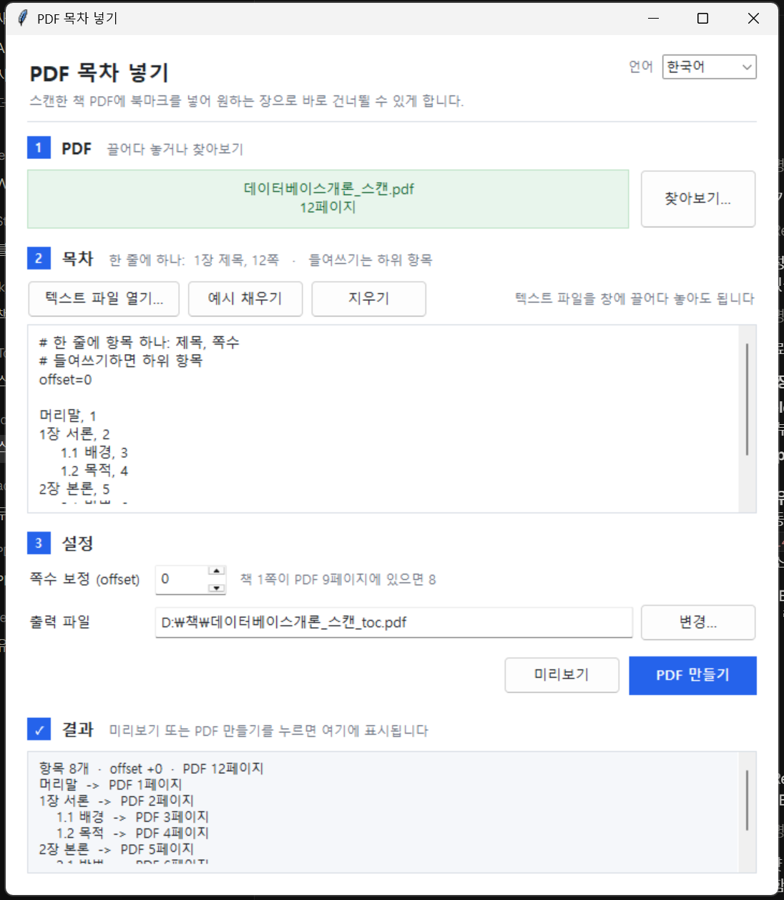

# PDF 목차 넣기 · PDF TOC Bookmarks · PDF 目录书签

[한국어](#한국어) · [English](#english) · [中文](#中文)

**[⬇ Download pdf_toc_add.exe (Windows)](https://github.com/microhan1/pdf-toc-add/releases/latest)** · No installation needed



---

## 한국어

스캔한 책 PDF는 북마크가 없어서 원하는 장으로 바로 못 건너뜁니다.
텍스트 파일에 `제목, 쪽수` 를 적어 주면 그대로 PDF 북마크(아웃라인)로 박아 주는 툴입니다.
화면과 메시지는 한국어, 영어, 중국어를 지원합니다.

### exe 로 쓰기 (설치 불필요)

[Releases](https://github.com/microhan1/pdf-toc-add/releases/latest) 에서 `pdf_toc_add.exe` 를 내려받아 더블클릭하면 창이 뜹니다. 서명이 없는 exe 라 처음에 Windows SmartScreen 경고가 뜨면 "추가 정보 → 실행" 을 누르세요.

- PDF 는 창에 **끌어다 놓거나** 찾아보기로 고릅니다. exe 아이콘 위에 PDF 를 놓아도 됩니다.
- 목차는 **텍스트 파일을 끌어다 놓거나** 열기 버튼으로 불러오고, 입력칸에 **직접 타이핑**해도 됩니다.
- 미리보기로 연결 페이지를 확인한 뒤 PDF 만들기를 누릅니다.
- 언어는 오른쪽 위에서 바꿉니다. Windows 표시 언어에 맞춰 자동 선택되고, 바꾸면 기억됩니다.

자세한 설명은 [usage.html](usage.html) 을 보세요.

### 목차 파일 형식

```
offset=8

머리말, 1
1장 서론, 12쪽
    1.1 배경, 13
2장 본론 ...... 25
3장 결론, 40
```

- 줄 끝 숫자가 쪽수입니다. 쉼표, 탭, 점선, `p.`, `쪽` 은 있어도 없어도 됩니다.
- 들여쓰기하면 하위 항목. `#` 줄과 빈 줄은 무시.
- `offset=8` 은 인쇄 쪽수와 PDF 페이지 차이입니다. 책 1쪽이 PDF 9페이지면 8.
- UTF-8, UTF-16, CP949, GB18030 자동 판별.

### 명령줄

```bash
pip install -r requirements.txt
python pdf_toc_add.py 책.pdf 목차.txt [--offset 8] [-o 결과.pdf] [--dry-run] [--lang ko|en|zh]
```

### 오류 처리

- 잘못된 줄을 전부 모아 행 번호, 원문, 고치는 방법을 보여주고, GUI 에서는 그 줄을 빨갛게 표시합니다.
- 잡아내는 것: 쪽수 없는 줄, 로마 숫자 쪽수, 숫자만 있는 줄, 쪽수 0, 잘못된 offset 값, PDF 범위를 벗어난 쪽수, 목차 자리의 PDF/이미지/Word 파일, PDF 가 아닌 파일, 손상되거나 암호 걸린 PDF, 잠긴 출력 파일, 없는 출력 폴더.
- 경고만 하는 것: 쪽수 범위(`12-15` 는 12 사용), 앞 항목보다 작은 쪽수, `#` 주석이 된 항목, offset 줄 중복.

### 개발

```bash
pip install -r requirements.txt pytest pyinstaller
python -m pytest tests -q
python -m PyInstaller --onefile --windowed --name pdf_toc_add pdf_toc_add.py
```

빌드된 exe 는 저장소에 넣지 않고 GitHub Releases 에 올립니다.

문자열은 [i18n.py](i18n.py) 한 곳에 모여 있습니다. 언어를 추가하려면 `STRINGS` 에 표를 하나 더 넣고 `LANGS`, `LANG_NAMES` 에 등록하면 됩니다.

---

## English

Scanned book PDFs have no bookmarks, so you cannot jump to a chapter.
This tool takes a plain-text list of `title, page` lines and writes them into the PDF as bookmarks (an outline).
The interface and messages are available in Korean, English and Chinese.

### Using the exe (no install)

Download `pdf_toc_add.exe` from [Releases](https://github.com/microhan1/pdf-toc-add/releases/latest) and double-click it. The exe is unsigned, so if Windows SmartScreen appears the first time, click "More info → Run anyway".

- **Drag and drop** the PDF onto the window, or use Browse. Dropping a PDF onto the exe icon also works.
- **Drop a text file** for the table of contents, open one with the button, or **type it directly**.
- Press Preview to check the page mapping, then Create PDF.
- The language selector is at the top right. It follows the Windows display language and remembers your choice.

See [usage.html](usage.html) for the full guide.

### TOC file format

```
offset=8

Preface, 1
Chapter 1 Introduction, 12
    1.1 Background, 13
Chapter 2 Body ...... 25
Chapter 3 Conclusion p.40
```

- The number at the end of the line is the page. Commas, tabs, dot leaders, `p.` and `page` are optional.
- Indent for sub-entries. `#` lines and blank lines are ignored.
- `offset=8` is the difference between printed and PDF page numbers: if book page 1 is PDF page 9, use 8.
- UTF-8, UTF-16, CP949 and GB18030 are detected automatically.

### Command line

```bash
pip install -r requirements.txt
python pdf_toc_add.py book.pdf toc.txt [--offset 8] [-o out.pdf] [--dry-run] [--lang ko|en|zh]
```

### Error handling

- Every bad line is reported at once with its line number, the original text and how to fix it. The GUI highlights those lines in red.
- Caught: missing page numbers, Roman-numeral pages, number-only lines, page 0, bad offset values, pages outside the PDF, PDF/image/Word files given as the TOC, non-PDF or damaged or password-protected PDFs, locked output files, missing output folders.
- Warnings only: page ranges (`12-15` uses 12), pages smaller than the previous entry, entries commented out with `#`, duplicate offset lines.

### Development

```bash
pip install -r requirements.txt pytest pyinstaller
python -m pytest tests -q
python -m PyInstaller --onefile --windowed --name pdf_toc_add pdf_toc_add.py
```

All strings live in [i18n.py](i18n.py). To add a language, add a table to `STRINGS` and register it in `LANGS` and `LANG_NAMES`.

---

## 中文

扫描的图书 PDF 没有书签，无法直接跳转到某一章。
本工具读取写有 `标题, 页码` 的文本文件，并将其写入 PDF 作为书签（大纲）。
界面和提示支持韩语、英语和中文。

### 使用 exe（无需安装）

从 [Releases](https://github.com/microhan1/pdf-toc-add/releases/latest) 下载 `pdf_toc_add.exe` 并双击运行。exe 未签名，首次运行若出现 Windows SmartScreen 提示，请点击“更多信息 → 仍要运行”。

- 把 PDF **拖入窗口**或点“浏览”。把 PDF 拖到 exe 图标上也可以。
- 目录可以**拖入文本文件**、用按钮打开，或**直接输入**。
- 点“预览”确认页码对应关系，再点“生成 PDF”。
- 语言在右上角切换。默认跟随 Windows 显示语言，切换后会记住。

详细说明见 [usage.html](usage.html)。

### 目录文件格式

```
offset=8

前言, 1
第1章 绪论, 12
    1.1 背景, 13
第2章 正文 ...... 25
第3章 结论 第40页
```

- 行尾数字为页码。逗号、制表符、点线、`第`、`页` 有无均可。
- 缩进表示子项。`#` 行和空行会被忽略。
- `offset=8` 是印刷页码与 PDF 页码之差：书的第 1 页是 PDF 第 9 页时填 8。
- 自动识别 UTF-8、UTF-16、GB18030、CP949。

### 命令行

```bash
pip install -r requirements.txt
python pdf_toc_add.py book.pdf toc.txt [--offset 8] [-o out.pdf] [--dry-run] [--lang ko|en|zh]
```

### 错误处理

- 一次列出所有问题行，包括行号、原文和修改方法；GUI 中会将这些行标红。
- 可检测：缺少页码、罗马数字页码、只有数字的行、页码 0、offset 值无效、页码超出 PDF 范围、把 PDF/图片/Word 文件当作目录、非 PDF 或损坏或加密的 PDF、被占用的输出文件、不存在的输出文件夹。
- 仅警告：页码范围（`12-15` 取 12）、页码小于前一项、被 `#` 注释掉的条目、重复的 offset 行。

### 开发

```bash
pip install -r requirements.txt pytest pyinstaller
python -m pytest tests -q
python -m PyInstaller --onefile --windowed --name pdf_toc_add pdf_toc_add.py
```

所有字符串都在 [i18n.py](i18n.py) 中。要新增语言，在 `STRINGS` 中添加一张表，并在 `LANGS` 和 `LANG_NAMES` 中登记即可。
